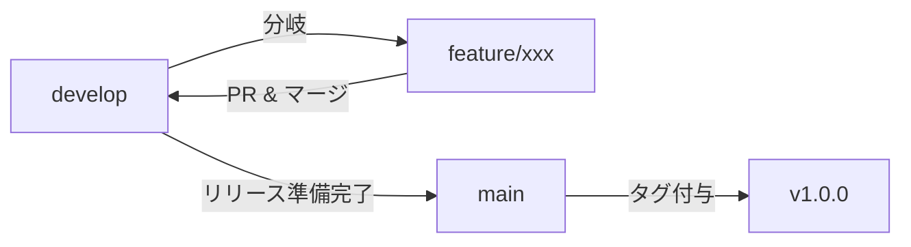
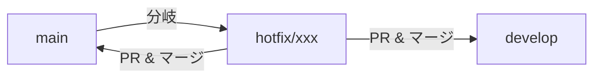

# Git ブランチ運用ポリシー

本ドキュメントでは、baseball-record プロジェクトにおけるブランチの運用ルールを定めます。

---

## ブランチ一覧

| ブランチ名 | 種別 | 用途 | 命名規則 |
|---|---|---|---|
| `main` | 永続 | 本番リリース済みの安定コード | — |
| `develop` | 永続 | 開発中の最新コードを統合するブランチ | — |
| `feature/*` | 一時 | 新機能の開発 | `feature/<issue番号>-<概要>` 例: `feature/12-add-player-stats` |
| `fix/*` | 一時 | バグ修正 | `fix/<issue番号>-<概要>` 例: `fix/25-fix-score-calculation` |
| `hotfix/*` | 一時 | 本番環境の緊急修正 | `hotfix/<概要>` 例: `hotfix/fix-login-error` |
| `chore/*` | 一時 | リファクタリング・設定変更・ドキュメント更新など | `chore/<概要>` 例: `chore/update-eslint-config` |

---

## 各ブランチの用途

### `main`
- **本番環境にデプロイ済みの安定コード** を保持するブランチ
- 直接コミットは禁止。必ず Pull Request 経由でマージする
- マージ後にタグ（バージョン番号）を付与する

### `develop`
- **開発中の最新コード** を統合するブランチ
- 各 feature/fix ブランチの統合先となる
- 直接コミットは原則禁止。Pull Request 経由でマージする

### `feature/*`
- **新機能の開発** を行うブランチ
- `develop` から分岐し、完了後 `develop` へマージする
- 1機能 = 1ブランチの原則を守る

### `fix/*`
- **バグ修正** を行うブランチ
- `develop` から分岐し、完了後 `develop` へマージする

### `hotfix/*`
- **本番環境の緊急修正** を行うブランチ
- `main` から分岐し、完了後 `main` と `develop` の両方へマージする

### `chore/*`
- **リファクタリング・設定変更・ドキュメント更新** など、機能追加やバグ修正に該当しない作業
- `develop` から分岐し、完了後 `develop` へマージする

---

## 開発作業とブランチの運用フロー

### 通常の開発フロー



1. `develop` ブランチから作業用ブランチを作成する
   ```bash
   git checkout develop
   git pull origin develop
   git checkout -b feature/<issue番号>-<概要>
   ```
2. 作業用ブランチで開発を進め、こまめにコミットする
3. 開発完了後、`develop` ブランチへ Pull Request を作成する
4. レビュー・承認後、`develop` へマージする
5. マージ済みの作業用ブランチは削除する

### 緊急修正フロー（hotfix）



1. `main` ブランチから `hotfix/*` ブランチを作成する
2. 修正を実施し、コミットする
3. `main` と `develop` の両方へ Pull Request を作成し、マージする
4. `main` にタグを付与する

### リリースフロー

1. `develop` の内容が安定したら、`main` へ Pull Request を作成する
2. レビュー・承認後、`main` へマージする
3. `main` にリリースタグ（例: `v1.0.0`）を付与する

---

## コミットメッセージ規約

### フォーマット

```
${絵文字} ${コミット区分}: ${目的や内容を簡潔に記載}
```

### コミット区分と絵文字の対応表

| 絵文字 | コミット区分 | 用途 | サンプル |
|---|---|---|---|
| ✨ | feat | 新機能の追加 | `✨ feat: 選手成績一覧画面を追加` |
| 🐛 | fix | バグ修正 | `🐛 fix: 打率計算の小数点丸め誤差を修正` |
| 🔥 | hotfix | 本番環境の緊急修正 | `🔥 hotfix: ログイン認証エラーを緊急修正` |
| ♻️ | refactor | リファクタリング（機能変更なし） | `♻️ refactor: スコア計算ロジックを関数に分離` |
| 📝 | docs | ドキュメントの追加・更新 | `📝 docs: ブランチ運用ポリシーを追加` |
| 🎨 | style | コードスタイル・フォーマット修正 | `🎨 style: ESLint指摘箇所を修正` |
| ✅ | test | テストの追加・修正 | `✅ test: 打率計算のユニットテストを追加` |
| 🔧 | chore | 設定・ビルド・依存関係の変更 | `🔧 chore: ESLint設定を更新` |
| 🗃️ | db | DB関連（DDL・マイグレーション等） | `🗃️ db: playersテーブルにposition列を追加` |
| ⬆️ | deps | 依存パッケージの更新 | `⬆️ deps: React を v18.3.0 に更新` |
| 🚀 | perf | パフォーマンス改善 | `🚀 perf: クエリにインデックスを追加して高速化` |

### 記述ルール

- **言語**: 日本語で記述する
- **文字数**: 50文字以内を目安にする
- **文体**: 体言止めまたは「〜する」で統一する（例: `追加` / `修正` / `更新`）
- **区切り**: 絵文字とコミット区分の間はスペース1つ、コミット区分と内容の間は `: `（コロン＋スペース）

---

## 補足ルール

- **ブランチの削除**: マージ済みの一時ブランチは速やかに削除する
- **コンフリクト解決**: マージ先のブランチから最新を取り込んでから PR を作成する
