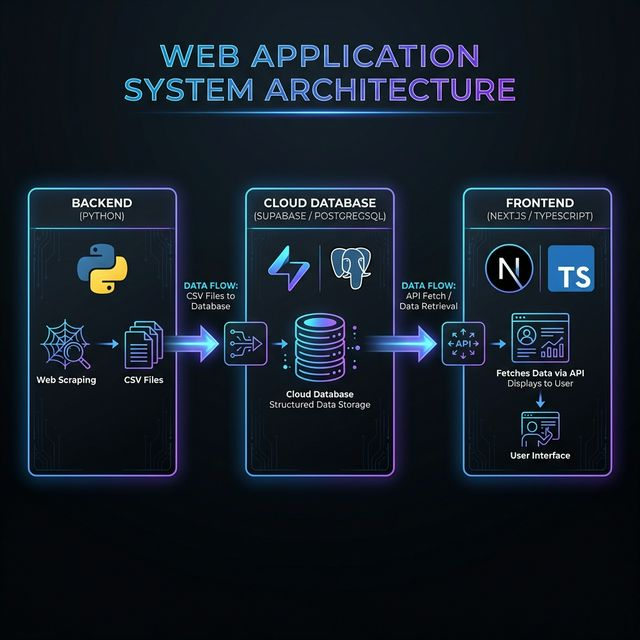
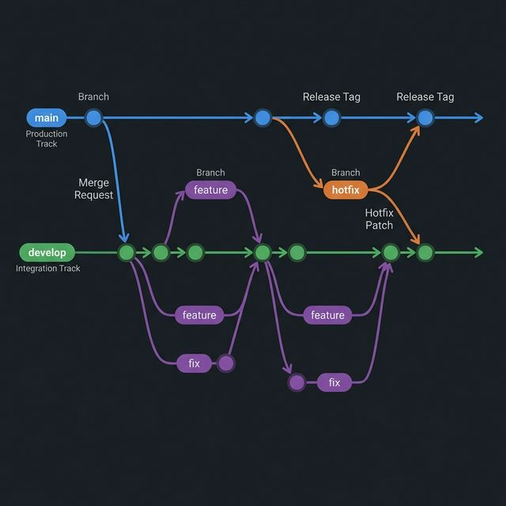

# baseball-record

## 概要

野球チームの試合情報や選手成績を自動収集・蓄積・閲覧するためのシステムです。

- **バックエンド**: Pythonスクレイピングで野球成績データを収集し、CSVに保存した後 Supabase へ投入
- **データベース**: Supabase（PostgreSQL）でマスターデータ・トランザクションデータを管理
- **フロントエンド**: Next.js（TypeScript）製のWebアプリでデータを閲覧

## システム構成

### 全体アーキテクチャ



1. バックエンドがWebサイトから野球記録をスクレイピングし、CSVファイルとして保存
2. CSVデータを Supabase（PostgreSQL）へ投入・更新
3. フロントエンドが Supabase から直接データを取得し、ブラウザ上で表示

### 技術スタック

| レイヤー | 技術 |
|---|---|
| バックエンド | Python 3, requests, BeautifulSoup4, supabase-py, python-dotenv |
| データベース | Supabase（PostgreSQL） |
| フロントエンド | Next.js 16, React 19, TypeScript 5, Tailwind CSS 4, Radix UI |
| ホスティング | Vercel（フロントエンド）, Supabase（データベース） |
| 分析 | Vercel Analytics |

## バックエンド（データ収集）

### スクレイピング処理

`backend/src/` 配下の Python スクリプトで構成されます。`00_run_all.py` をメインエントリーポイントとして、以下の6つのスクレイピングスクリプトを順次実行します。

| スクリプト | 概要 | 出力ファイル |
|---|---|---|
| `01_get_game_info.py` | 試合情報の取得 | `01_game_info.csv` |
| `02_get_game_hitter_stats.py` | 試合別打者成績の取得 | `02_game_hitter_stats.csv` |
| `03_get_game_pitcher_stats.py` | 試合別投手成績の取得 | `03_game_pitcher_stats.csv` |
| `04_get_team_stats.py` | チーム成績の取得 | `04_team_stats.csv` |
| `05_get_hitter_stats.py` | 打者成績の取得 | `05_hitter_stats.csv` |
| `06_get_pitcher_stats.py` | 投手成績の取得 | `06_pitcher_stats.csv` |

その他の共通モジュール:

| ファイル | 概要 |
|---|---|
| `99_utils.py` | 共通ユーティリティ関数（引数解析、ファイル操作など） |
| `constants.py` | 定数定義（ファイルパス等） |

#### 特徴

- **複数チーム対応**: 1回の実行で複数チームのデータを取得可能
- **テストモード**: `--test` オプションで少量データのみ取得して動作確認
- **エラーハンドリング**: 個別スクリプトでエラーが発生しても処理を継続
- **自動ファイル管理**: 既存の出力ファイルを日付付き（`yyyymmdd`）で自動リネーム
- **実行結果サマリー**: 全スクリプトの実行結果（成功/失敗）を一覧表示

### 入力ファイル

`backend/input/` ディレクトリに配置する CSV ファイルです。

#### チーム情報 (`00_teams_info.csv`)

| 項目名 | 型 | 説明 |
|---|---|---|
| key | 文字列 | チームの識別子（コマンドライン引数で使用） |
| team | 文字列 | チームコード |
| team_name | 文字列 | チームの正式名称 |

#### 選手情報 (`01_players_info.csv`)

| 項目名 | 型 | 説明 |
|---|---|---|
| key | 文字列 | 選手の識別子（`${team}_${player_number}` 形式） |
| team | 文字列 | チームコード |
| player_number | 数値 | 背番号 |
| player_name | 文字列 | 選手名 |
| nickname | 文字列 | ニックネーム |

### 出力ファイル

すべての出力ファイルは `backend/output/` ディレクトリに保存されます。
各出力ファイルの項目定義の詳細は `backend/README.md` を参照してください。

- `01_game_info.csv` — 試合情報（日程・スコア・責任投手など）
- `02_game_hitter_stats.csv` — 試合別打者成績（打席・安打・打点など）
- `03_game_pitcher_stats.csv` — 試合別投手成績（投球回・奪三振・失点など）
- `04_team_stats.csv` — チーム年度別成績（勝敗・打率・防御率など）
- `05_hitter_stats.csv` — 打者年度別成績（打率・本塁打・OPSなど）
- `06_pitcher_stats.csv` — 投手年度別成績（防御率・WHIP・K/BBなど）

### Supabaseへのデータ連携

CSVファイルを Supabase へ投入するための2つのスクリプトがあります。

| スクリプト | 概要 |
|---|---|
| `load_to_supabase.py` | 全テーブルのデータを一括投入（初回セットアップ用）。既存データを削除してから投入する |
| `update_supabase.py` | 既存レコードの更新（`created_dt`保持、`updated_dt`更新）と新規レコードの登録を行うUPSERT処理 |

共通の処理:
- CSV読み込み時に型変換（整数・小数カラムの自動判定）
- バッチ単位（500件）での投入処理
- `delete_flg` と `created_dt` / `updated_dt` の自動付与

## データベース（Supabase）

### テーブル定義

DDLは `backend/ddl/create_tables.sql` に定義されています。テーブルはマスター系とトランザクション系に分類されます。

| テーブル名 | 種別 | 概要 |
|---|---|---|
| `master_teams_info` | マスター | チーム情報 |
| `master_players_info` | マスター | 選手情報 |
| `transaction_game_info` | トランザクション | 試合情報 |
| `transaction_game_hitter_stats` | トランザクション | 試合別打者成績 |
| `transaction_game_pitcher_stats` | トランザクション | 試合別投手成績 |
| `transaction_team_stats` | トランザクション | チーム年度別成績 |
| `transaction_hitter_stats` | トランザクション | 打者年度別成績 |
| `transaction_pitcher_stats` | トランザクション | 投手年度別成績 |

### データ構造

全テーブルに共通する管理カラム:

| カラム名 | 型 | 説明 |
|---|---|---|
| `key` | TEXT (PK) | 各レコードの一意識別子 |
| `delete_flg` | INTEGER | 論理削除フラグ（0: 有効, 1: 削除） |
| `created_dt` | TIMESTAMPTZ | レコード作成日時 |
| `updated_dt` | TIMESTAMPTZ | レコード更新日時 |

各テーブルの詳細なカラム定義は `backend/ddl/create_tables.sql` および `backend/README.md` を参照してください。

## フロントエンド（Webアプリケーション）

### ページ構成・ルーティング

Next.js の App Router を使用しています。

| パス | ページ | 概要 |
|---|---|---|
| `/` | トップ | チーム一覧を表示。各チームから試合結果・チーム成績・選手一覧へ遷移 |
| `/game` | 試合結果一覧 | 試合結果の一覧を表示 |
| `/game/[id]` | 試合詳細 | スコアボード・責任投手・打者/投手成績を表示 |
| `/team/[team]` | チームトップ | `/team/[team]/stats` へリダイレクト |
| `/team/[team]/stats` | チーム成績 | チーム成績・打者成績・投手成績をタブ切替で表示（今年度/通算/月別など） |
| `/team/[team]/player` | 選手一覧 | チーム所属選手の一覧（背番号・名前）を表示 |
| `/team/[team]/player/[player_number]` | 選手詳細 | 個人成績の詳細表示 |

### コンポーネント一覧

`frontend/components/` 配下の主要コンポーネント:

| コンポーネント | 概要 |
|---|---|
| `Header` | ヘッダーナビゲーション |
| `Footer` | フッター |
| `Breadcrumb` / `BreadcrumbContext` | パンくずリスト（コンテキスト管理含む） |
| `PageLayout` | ページ共通レイアウト |
| `TeamSelect` | チーム選択UI |
| `TeamStatsTabs` | チーム成績のタブ管理（メインコンポーネント） |
| `GameList` | 試合結果一覧 |
| `PlayerStatsTabs` | 選手成績のタブ管理 |
| `HitterStatsTable` / `PitcherStatsTable` | 打者/投手成績テーブル |
| `CurrentYearHitterStats` / `CurrentYearPitcherStats` | 今年度の打者/投手成績 |
| `MonthlyHitterStats` / `MonthlyPitcherStats` | 月別打者/投手成績 |
| `RecentGamesHitterStats` / `RecentGamesPitcherStats` | 直近試合の成績 |
| `BattingOrderHitterStats` | 打順別打者成績 |
| `PositionHitterStats` | 守備位置別打者成績 |
| `GroundHitterStats` / `GroundPitcherStats` | 球場別成績 |
| `UsagePitcherStats` | 投手起用別成績 |

UIコンポーネントは `frontend/components/ui/` 配下に Radix UI ベースのコンポーネント（Button, Card, Dialog, Tabs, Select など）を配置しています。

### データ取得・表示フロー

1. 各ページコンポーネントが `@supabase/supabase-js` クライアントを使用して Supabase から直接データを取得
2. クライアントサイドレンダリング（`"use client"`）で動的にデータを表示
3. `delete_flg = 0` のレコードのみ取得（論理削除対応）
4. ローディング状態・エラー状態のハンドリングを各ページで実装

## 環境構築

### 前提条件

- Python 3.x
- Node.js（v18以上推奨）
- npm
- Supabase プロジェクト（アカウントとプロジェクトの作成が必要）

### バックエンドのセットアップ

```bash
cd backend

# Python仮想環境の作成・有効化
python3 -m venv .venv
source .venv/bin/activate

# 依存パッケージのインストール
pip install -r requirements.txt
```

### フロントエンドのセットアップ

```bash
cd frontend

# 依存パッケージのインストール
npm install
```

### 環境変数

バックエンドとフロントエンドそれぞれに `.env` ファイルが必要です。

#### バックエンド (`backend/.env`)

| 変数名 | 説明 |
|---|---|
| `SUPABASE_URL` | SupabaseプロジェクトのURL |
| `SUPABASE_KEY` | SupabaseプロジェクトのAPIキー |

#### フロントエンド (`frontend/.env`)

| 変数名 | 説明 |
|---|---|
| `NEXT_PUBLIC_SUPABASE_URL` | SupabaseプロジェクトのURL（クライアント公開用） |
| `NEXT_PUBLIC_SUPABASE_ANON_KEY` | Supabaseの匿名キー（クライアント公開用） |

## 使い方

### バックエンド（データ収集の実行）

```bash
cd backend

# 仮想環境の有効化
source .venv/bin/activate

# 単一チームのデータを取得
python3 src/00_run_all.py <チーム名>

# 複数チームのデータを取得
python3 src/00_run_all.py <チーム名1> <チーム名2>

# テストモード（少量のデータのみ取得）
python3 src/00_run_all.py <チーム名> --test

# Supabase へデータを初回一括投入
python3 src/load_to_supabase.py

# Supabase のデータを差分更新（UPSERT）
python3 src/update_supabase.py
```

チーム名は英数字、ハイフン(`-`)、アンダースコア(`_`)のみ使用可能です。

### フロントエンド（開発サーバーの起動）

```bash
cd frontend

# 開発サーバーの起動
npm run dev
```

ブラウザで `http://localhost:3000` を開くとアプリケーションにアクセスできます。

## ディレクトリ構成

```
baseball-record/
├── backend/                          # バックエンド
│   ├── src/                          # Pythonスクリプト
│   │   ├── 00_run_all.py            # メインスクリプト（全スクリプト順次実行）
│   │   ├── 01_get_game_info.py      # 試合情報の取得
│   │   ├── 02_get_game_hitter_stats.py  # 試合別打者成績の取得
│   │   ├── 03_get_game_pitcher_stats.py # 試合別投手成績の取得
│   │   ├── 04_get_team_stats.py     # チーム成績の取得
│   │   ├── 05_get_hitter_stats.py   # 打者成績の取得
│   │   ├── 06_get_pitcher_stats.py  # 投手成績の取得
│   │   ├── 99_utils.py              # 共通ユーティリティ関数
│   │   ├── constants.py              # 定数定義
│   │   ├── load_to_supabase.py      # Supabase一括投入
│   │   └── update_supabase.py       # Supabase差分更新
│   ├── ddl/                          # テーブル定義SQL
│   │   └── create_tables.sql        # 全テーブルのDDL
│   ├── input/                        # 入力ファイル（CSV）
│   ├── output/                       # 出力ファイル（CSV）
│   ├── requirements.txt              # Python依存パッケージ
│   ├── .env                          # 環境変数（Git管理外）
│   └── README.md                     # バックエンド詳細仕様書
├── frontend/                         # フロントエンド
│   ├── app/                          # Next.js App Router
│   │   ├── page.tsx                 # トップページ
│   │   ├── layout.tsx               # 共通レイアウト
│   │   ├── globals.css              # グローバルCSS
│   │   ├── game/                    # 試合関連ページ
│   │   │   ├── page.tsx            # 試合結果一覧
│   │   │   └── [id]/page.tsx       # 試合詳細
│   │   └── team/                    # チーム関連ページ
│   │       ├── page.tsx            # チーム一覧
│   │       └── [team]/             # チーム別ページ
│   │           ├── page.tsx        # チームトップ（リダイレクト）
│   │           ├── stats/page.tsx  # チーム成績
│   │           └── player/         # 選手関連ページ
│   │               ├── page.tsx    # 選手一覧
│   │               └── [player_number]/page.tsx  # 選手詳細
│   ├── components/                   # Reactコンポーネント
│   │   ├── ui/                      # UIプリミティブ（Radix UI）
│   │   └── *.tsx                    # 各種コンポーネント
│   ├── lib/                          # ユーティリティ・型定義
│   │   ├── supabase.ts             # Supabaseクライアント
│   │   ├── types.ts                # 型定義
│   │   ├── statsTypes.ts           # 成績関連の型定義
│   │   └── utils.ts                # ユーティリティ関数
│   ├── package.json                  # npm依存パッケージ
│   ├── tsconfig.json                 # TypeScript設定
│   ├── next.config.ts                # Next.js設定
│   ├── .env                          # 環境変数（Git管理外）
│   └── README.md                     # フロントエンド詳細仕様書
├── .gitignore                        # Git除外設定
└── README.md                         # 本ファイル（プロジェクト全体の仕様書）
```

## ブランチ運用ルール

詳細は [.antigravity/rules/git-branch-policy.md](file:///.antigravity/rules/git-branch-policy.md) を参照してください。

### ブランチ構成図



| ブランチ名 | 種別 | 用途 |
|---|---|---|
| `main` | 永続 | 本番リリース済みの安定コード |
| `develop` | 永続 | 開発中の最新コードを統合 |
| `feature/*` | 一時 | 新機能の開発 |
| `fix/*` | 一時 | バグ修正 |
| `hotfix/*` | 一時 | 本番環境の緊急修正 |
| `chore/*` | 一時 | リファクタリング・設定変更・ドキュメント更新 |

### コミットメッセージ規約

```
${絵文字} ${コミット区分}: ${目的や内容を簡潔に記載}
```

例: `✨ feat: 選手成績一覧画面を追加`

## ライセンス

- 開発者の許諾なく編集、改変した上で再配布を禁ずる
- 開発者の許諾なく営利目的で再配布することを禁ずる